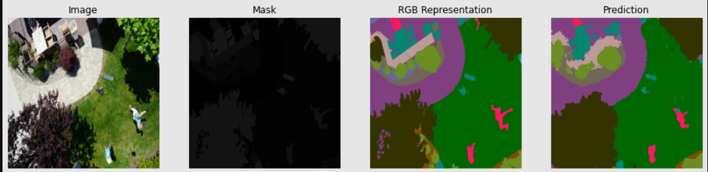

# Semantic Segmentation of Drone Imagery

This project performs **semantic segmentation** on drone imagery to identify 24 different land-cover classes.  
The model is based on **DeepLabV3+** with a **ResNet101 backbone**, fine-tuned on a Kaggle dataset.  
It outputs **RGB segmentation maps** for aerial images.

---

## 📂 Dataset
- **Kaggle Link**: [Semantic Drone Dataset](https://www.kaggle.com/datasets/bulentsiyah/semantic-drone-dataset)
- **Classes**: 24 land-cover types (e.g., buildings, roads, vegetation, water, etc.)
- **Image Format**: RGB aerial images with pixel-level annotations
- **Preprocessing**:
  - Resized images to **512×512** for training
  - Applied **Albumentations** augmentations:
    - Horizontal & vertical flips
    - Random rotations
    - Coarse dropout for occlusion simulation

---

## 🏗 Model Architecture
- **Backbone**: ResNet101 (pretrained on ImageNet)
- **Segmentation Head**: DeepLabV3+
- **Loss Function**: Sparse Categorical Crossentropy
- **Optimizer**: Adam (`lr=1e-4`)
- **Metrics**: Accuracy, Dice coefficient, Mean Intersection-over-Union (mIoU)

---

## 📊 Results
| Metric         | Value   |
|----------------|---------|
| Accuracy       | **0.8548** |
| Dice Coefficient | **0.7789** |
| mIoU           | **0.4649** |

Sample RGB segmentation outputs:
The model takes aerial drone imagery as input, segments it into 24 classes, and generates an RGB map.

